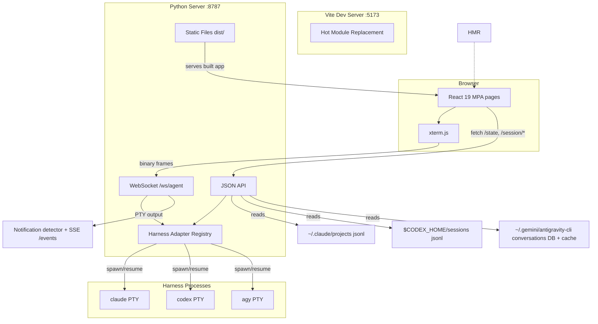
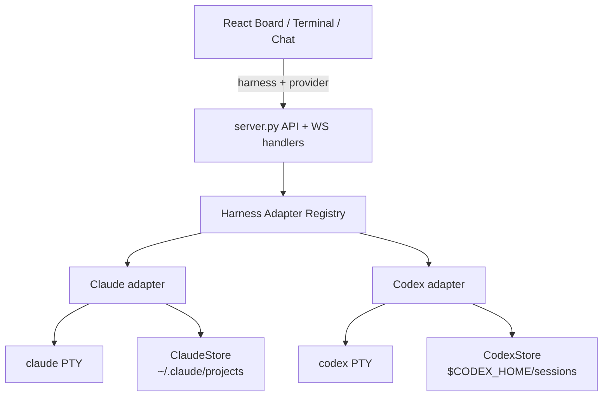

# React Architecture — orchestrator UI (HLD)

**Living** — states the *current* shape of the orchestrator UI. Bumped per-merge when structure, interfaces, or data flow change.
**ADRs:** [`0001-react-typescript-vite.md`](../adr/0001-react-typescript-vite.md) · [`0002-harness-adapter-registry.md`](../adr/0002-harness-adapter-registry.md) · [`0003-agent-page-view-param.md`](../adr/0003-agent-page-view-param.md) · [`0004-single-agent-shell-in-tab-view-switch.md`](../adr/0004-single-agent-shell-in-tab-view-switch.md) · [`0005-chat-read-only-transcript-viewer.md`](../adr/0005-chat-read-only-transcript-viewer.md) · [`0006-rich-transcript-api.md`](../adr/0006-rich-transcript-api.md) · [`0008-agy-antigravity-harness.md`](../adr/0008-agy-antigravity-harness.md) · [`0009-agy-discovery-source-contract.md`](../adr/0009-agy-discovery-source-contract.md) · [`0010-discovery-cache-poll-consolidation.md`](../adr/0010-discovery-cache-poll-consolidation.md)
**Design prototypes (sign-off):** `orchestrator-board/` · `orchestrator-terminal/` · `orchestrator-chat/`

---

## 1. System Architecture



**Production:** Vite builds → `dist/`. Python server serves `dist/` directly (no Vite dev server). Same API + WebSocket endpoints.

**Development:** `npm run dev` starts Vite on `:5173` with HMR. Vite proxies `/state`, `/session/*`, `/ws/*` to Python on `:8787`. Two terminals: `python3 server.py` + `npm run dev`.

## 2. Route Design

> **ADR-0003 + ADR-0004 (2026-07-18):** the two session pages are consolidated
> under one **agent page** keyed by `view`; ADR-0004 makes that one runtime
> shell too, so terminal/chat switching happens in-tab without killing or
> detaching the PTY session. `terminal` + `/ws/shell` remain reserved for the
> future board shell-terminal feature (own ADR required).

| Route | Page | Query Params | Notes |
|---|---|---|---|
| `/` | Board | — | Kanban board, polls `/state` every 5s |
| `/agent` | Agent session shell | `?session_id=<id>&view=terminal\|chat\|files&harness=<name>&provider=<name>&label=<text>` | Always serves `agent.html`; `view=chat` → chat pane; `view=files` → file navigator; `view=terminal` / omitted / unknown → terminal pane. New session if no `session_id` |
| `/terminal` | — (compat) | any | `302 → /agent?view=terminal&<qs>` (query preserved) |
| `/chat` | — (compat) | any | `302 → /agent?view=chat&<qs>`; **never spawns** (legacy spawn-on-GET removed, see §5) |
| `/events` | SSE stream | — | Lifecycle notifications (`approval_required`, `input_ready`) consumed by Board |

Routes are top-level (no nested layouts). Board opens the agent page in new
tabs via `window.open()`.

**No client router.** The board and agent are separate Vite MPA entries:
`src/main.tsx` → Board and `src/terminal.tsx` → `AgentPage`. The server always
serves `agent.html` for `/agent`; `AgentPage` reads and updates `view` itself.
There is no `chat.html` entry. The compat `/chat` route redirects to
`/agent?view=chat&<qs>`.

## 3. Component Tree

### 3.1 Board (`/`)

```
Board
├── Header
│   ├── Brand            (orchestrator + version chip)
│   ├── RepoIndicator    (live dot + repo name)
│   ├── ViewToggle       (Active | Archive — segmented control)
│   ├── TabAlertIndicator (unread lifecycle badge; no desktop Notification API)
│   └── NewSessionButton → opens NewSessionDialog
├── BoardGrid
│   └── Column[] ×4      (Working | Awaiting | Idle | Blocked)
│       ├── ColumnHead   (swatch dot + title + count badge)
│       ├── Card[]
│       │   ├── CardTop       (title + state badge)
│       │   ├── SessionId     (mono, copyable)
│       │   ├── CardMeta      (age · turns · cost)
│       │   ├── Chips         (harness · provider · PR · branch · merged)
│       │   ├── Note          (blocked reason / read-only)
│       │   ├── CardSelect    (checkbox for many-session actions)
│       │   ├── CardActions   (Chat · Terminal · Transcript · CopyID · Kill · Dismiss)
│       │   └── TranscriptDrawer (expandable, loads on toggle)
│       └── EmptyState   (dashed placeholder)
├── BulkActionBar        (visible-session selection count · select all · clear · Dismiss selected / Restore selected)
├── NewSessionDialog     (modal overlay — always opens view=terminal; chat is a viewer for existing sessions, ADR-0005)
│   ├── HarnessSelector  (radio: Claude | Codex | Antigravity)
│   ├── ProviderSelector (radio: harness-local providers)
│   └── LabelInput       (optional text)
└── Toast                (fixed bottom-right)
```

### 3.2 Agent Shell (`/agent`)

```
AgentPage
├── Topbar              (Terminal | Chat segmented control)
├── MainArea
│   ├── LeftDrawer      (session list; selecting a session stays in /agent)
│   ├── Center
│   │   ├── TerminalPane (kept mounted after first open; hidden in chat view)
│   │   └── ChatPane     (message transcript + input + state banner)
│   └── RightDrawer     (session details; Files toggle only in terminal view)
└── StatusBar
```

`view` is presentation state inside `AgentPage`. Terminal → chat switching
updates the query string but keeps the mounted terminal pane and WebSocket
subscriber alive; only Close detaches and only Kill terminates the PTY.

### 3.3 Terminal Pane (`/agent?view=terminal`)

```
AgentPage
├── Topbar
│   ├── DrawerToggle (☰ left)
│   ├── Breadcrumb   (repo / session title)
│   ├── Spacer
│   ├── StatusGlyph  (spinner · dot · ended)
│   ├── ViewToggle   (Terminal | Chat)
│   ├── DrawerToggle (⚙ right)
│   ├── KillButton   (⏻ danger)
│   └── CloseButton  (✕ detach)
├── MainArea (flex row)
│   ├── LeftDrawer (collapsible, 240px)
│   │   └── SessionList
│   │       └── SessionRow[] (title · provider chip · age · activity dot)
│   ├── Center (flex 1)
│   │   ├── TerminalBody        (view=terminal)
│   │   │   ├── XtermContainer  (ref → xterm.js Terminal)
│   │   │   └── EndedOverlay    (conditional)
│   │   └── FilesPanel          (view=files)
│   │       ├── FileRow[]       (name · +adds · −dels · staged dot)
│   │       └── CommitArea      (textarea + Commit & Push / Create PR)
│   └── RightDrawer (collapsible, 280px)
│       └── SessionDetails
│           ├── HarnessProvider (chips)
│           ├── PRPill          (PR #n · mergeable / CI failed / review / No PR)
│           ├── Stats           (turns · cost · age)
│           ├── Git             (branch · worktree path)
│           ├── SessionId       (mono, full)
│           └── ViewToggle      (Terminal | Files)
└── StatusBar
    ├── Dot       (live · ended · waiting)
    ├── Label     (connected · session ended · connecting…)
    └── SessionId (mono, truncated)
```

### 3.4 Chat Pane (`/agent?view=chat`)

> **ADR-0005 (2026-07-18):** the chat pane is now a **read-only transcript viewer**.
> Chat sends are removed — the terminal view is the sole interaction surface.
> The chat pane reads the JSONL transcript and presents it as structured,
> scrollable conversation. Smart scroll pauses auto-scroll when the user reads
> history; a floating badge offers to jump back to the bottom.

> **ADR-0007 (2026-07-18):** Phase 3 adds session insights + actions — cost in
> the ReadOnlyBar, per-message copy (full markdown), transcript export (`.md`),
> honest scroll-badge label ("↓ Jump to latest" when no new messages).

```
AgentPage
├── Topbar              (shared with Terminal)
├── MainArea
│   ├── LeftDrawer      (shared with Terminal)
│   ├── ChatBody
│   │   ├── StateBanner       (connecting… / loading… / session ended)
│   │   ├── MessageList
│   │   │   ├── TurnSeparator[]     (NEW — "Turn N" divider between user→asst cycles)
│   │   │   ├── MessageBubble[]     (user → right, asst → left)
│   │   │   │   └── RichBlock[]     (per-block: text → markdown, thinking → 💭 collapsible, tool_use → 🔧 badge, tool_result → 📋 collapsible — ADR-0006)
│   │   │   │   └── MetaRow         (timestamp · model · ↥/↧ tokens)
│   │   │   │   └── CopyButton      (ADR-0007 — hover copy, full markdown via lib/export-markdown; hidden when clipboard API unavailable)
│   │   │   ├── TypingIndicator     (3 bouncing dots)
│   │   │   └── ScrollBadge         (renders whenever scrolled up; label — ADR-0007: "↓ New messages" if new msgs arrived, else "↓ Jump to latest")
│   │   └── ReadOnlyBar    (REPLACES ChatInput — ADR-0005)
│   │       ├── StatusText  (state-dependent: "Assistant is working…" / "Session ended" / "📖 Read-only transcript")
│   │       ├── SwitchLink  (→ "Switch to Terminal to interact" — calls switchAgentView('terminal'))
│   │       ├── CostDisplay (ADR-0007 — total_cost_usd right-aligned; hidden when null)
│   │       └── ExportButton (ADR-0007 — download transcript-<sid>.md via Blob)
│   └── RightDrawer     (shared with Terminal)
└── StatusBar           (shared with Terminal)
```

### 3.5 File Navigator Pane (`/agent?view=files`)

> **2026-07-19:** dedicated view showing every file the agent touched during the
> session — extracted from `tool_use` blocks (Read/Write/Edit) in the transcript.
> Split panel: file list (left, 290px) grouped by operation/directory/time +
> content viewer (right) with line numbers and syntax highlighting.

```
AgentPage
├── Topbar              (shared — view toggle: Terminal | Chat | Files)
├── MainArea
│   ├── LeftDrawer      (shared)
│   ├── FileNavigator   (view=files; mounted only when active)
│   │   ├── FileList            (left panel — 290px)
│   │   │   ├── fl-head         (title "Files Touched" + count + group mode select)
│   │   │   │   └── group select (By Operation | By Directory | By Time)
│   │   │   ├── FileGroup[]     (sticky group headers: 📖 Read / ✏️ Edited / 📝 Written)
│   │   │   │   └── FileRow[]   (dot color · icon · basename · dirpath · relative time)
│   │   │   └── fl-empty        (when no file refs yet)
│   │   └── FileViewer          (right panel — flex 1)
│   │       ├── fv-head         (file path + op badge [Read|Edited|Written])
│   │       ├── fv-body
│   │       │   └── CodeView    (line numbers + syntax-highlighted content)
│   │       └── fv-empty        (select-file prompt / loading / error)
│   │
│   └── RightDrawer     (shared — ViewToggle hidden in files + chat views)
└── StatusBar           (shared)
```

**Data source:** `extractFileRefs(messages)` from `src/lib/file-refs.ts` — scans
`tool_use` blocks for Read/Write/Edit/NotebookEdit, deduplicates by `path:op`,
sorts by most-recent timestamp. Grouping functions (`groupFileRefs`) support
operation, directory, and time modes — shipped with operation as default;
directory and time selectors are live in the UI for future use.

**File content:** `GET /session/<id>/file?path=<abs_path>` → `{path, content,
size}`. Served from `server.py:_file_content` — reads the file from disk with
basic path safety (must be absolute, must exist, must resolve).

**New modules:** `src/components/files/FileNavigator.tsx` (container),
`FileList.tsx` (left panel), `FileViewer.tsx` (right panel + CodeView),
`src/lib/file-refs.ts` (extraction + grouping).

### 3.6 Shared components (used by Terminal + Chat + Files panes)

| Component | Used by | Notes |
|---|---|---|
| `Topbar` | Terminal, Chat, Files | Receives session, leftOpen, rightOpen, callbacks; view switch includes Files |
| `LeftDrawer` | Terminal, Chat, Files | Sessions list — identical UI, different click target per view |
| `RightDrawer` | Terminal, Chat, Files | Session details — identical; Chat + Files variants omit ViewToggle |
| `StatusBar` | Terminal, Chat, Files | Dot + label + sid |
| `StatusGlyph` | Topbar | Spinner (working) · dot (idle/awaiting/blocked) |
| `PRPill` | RightDrawer, Card chips | PR link with state color |
| `Toast` | All pages | Fixed position, auto-dismiss |

## 4. Data Flow

### 4.0 Harness session discovery

The board is session-centric. `GET /state` unions summaries from all harness
stores:

| Harness | Store module | Session source contract |
|---|---|---|
| `claude` | `claude_store.py` | `~/.claude/projects/<encoded-cwd>/*.jsonl` |
| `codex` | `codex_store.py` | `$CODEX_HOME/sessions/**/*.jsonl` |
| `agy` | `agy_store.py` | union of `conversations/*.db`, `cache/conversation_metadata.json`, and `cache/last_conversations.json` |

For `agy`, the SQLite DB filename is the durable existence/resume signal.
Metadata enriches the card when present; `last_conversations.json` is only a
workspace fallback/latest hint. If metadata is missing but the DB and cwd mapping
exist, the board still shows the card with an `Antigravity <sid>` fallback title
and `Metadata pending` note.

### 4.1 API Layer (`src/lib/api.ts`)

All server communication is centralized in typed fetch wrappers. No component calls `fetch()` directly.

```typescript
// Types (simplified — see src/lib/types.ts for full definitions)
interface SessionCard {
  session_id: string;
  title: string;
  harness: 'claude' | 'codex' | string;
  provider: string | null;
  activity: 'Working' | 'Awaiting' | 'Idle' | 'Blocked';
  // … all fields from discovery.SessionCard.to_dict()
}

interface Launcher {
  harness: string;
  providers: string[];
}

interface BoardState {
  generated_at: string;
  repo: string;
  activities: string[];
  launchers: Launcher[];
  // Legacy during migration; equivalent to launcher.providers for `claude`.
  providers: string[];
  sessions: SessionCard[];
}

interface Transcript {
  session_id: string;
  messages: { role: string; text: string; ts: string }[];
}

// Rich transcript (ADR-0006) — returned when ?format=rich
interface RichContentBlock {
  type: 'text' | 'thinking' | 'tool_use' | 'tool_result' | string;
  text?: string; thinking?: string;  // text / thinking
  id?: string; name?: string; input?: Record<string, unknown>;  // tool_use
  tool_use_id?: string; content?: string | RichContentBlock[];  // tool_result
}

interface RichMessage {
  role: string;
  ts: string;
  content: RichContentBlock[];
  model?: string;
  stop_reason?: string;
  usage?: { input_tokens?: number | null; output_tokens?: number | null };
}

interface RichTranscript {
  session_id: string;
  messages: RichMessage[];
}

// API functions
fetchBoardState(): Promise<BoardState>
fetchTranscript(sessionId: string, since?: string, format?: 'rich'): Promise<Transcript>
fetchRichTranscript(sessionId: string, since?: string): Promise<RichTranscript>  // ADR-0006
startSession(harness: string, provider: string): Promise<{session_id: string; session_started: boolean}>
killSession(sessionId: string): Promise<{ok: boolean}>
dismissSession(sessionId: string): Promise<{ok: boolean}>
dismissSessions(sessionIds: string[]): Promise<{ok: boolean, session_ids: string[], count: number}>
undismissSessions(sessionIds: string[]): Promise<{ok: boolean, session_ids: string[], count: number}>
```

### 4.2 Lifecycle Notifications

Board and the agent shell subscribe to `GET /events` through `EventSource`.
These events are not derived from board `activity`; they come from live PTY
output detectors in the server. The server emits `approval_required` for
high-confidence Claude/Codex approval prompts and `input_ready` when a live
harness appears ready for another owner turn. The Board shows an in-app toast
and increments a tab-title/header badge. It deliberately does **not** use the
browser desktop `Notification` API. `AgentPage` uses the same session-scoped
events to refresh the chat transcript, clear the chat pending state when
`input_ready` arrives, and mark the tab title/topbar. Fresh sessions subscribe
before `session_id` is known and replay a pending event once id capture
completes, so new Claude/Codex/agy tabs receive the same alerts as resumed
sessions.

`launchers` is server-derived, not hard-coded in the client. The Claude launcher
uses the same provider configuration as legacy `/state.providers`; when
external Claude providers are configured, Claude must expose them beside
`claude` (currently `deepseek` and `ollama`). Codex is a separate launcher with
`openai` as its initial provider.

### 4.3 Hooks

```
usePoll<T>(fetchFn, intervalMs)  →  { data, error, loading }
    │
    ├── useBoardState()           →  { sessions, providers, repo }
    │     polls /state every 5s
```

`AgentPage` owns the live session hooks directly because terminal and chat are
now two views of the same runtime:

```
AgentPage
    ├── useWebSocket(/ws/agent?session_id=...)
    │     keeps the PTY subscriber attached after terminal pane mount
    │     terminal output schedules transcript refresh for the chat pane
    │
    ├── useSessionNotifications(session_id)
    │     approval_required → tab/topbar alert
    │     input_ready       → transcript refresh + clear pending chat state
    │
    └── transcript refresh (ADR-0010 §3 — merged 5s poll)
          one timer → Promise.all([
            fetchRichTranscript(sessionId, since=lastTs),
            fetchBoardState() via fetchBoardStateIfActive,
          ])
          initial load: replace=true (full transcript + board state)
          steady state: since=lastTs (delta only)
          active turn:  1s fast-poll (transcript only)
          triggers: PTY output, input_ready (chat is read-only, ADR-0005)
```

**ADR-0010 change (2026-07-19):** the board-state poll and transcript poll are
merged into one 5s timer to halve `/state` calls. Board state fetch is extracted
as `fetchBoardStateIfActive` and called in parallel with transcript refresh.

The chat view treats `/session/:id/transcript` as the authoritative message
source. **ADR-0005 (2026-07-18): the chat pane is read-only.** `sendMessage()`
is no longer called from chat components — the terminal view is the sole
interaction surface. The client does **not** optimistically append messages;
the transcript poll is the single source of truth. While a turn is active
(detected via SSE `input_ready`), the `ReadOnlyBar` shows "Assistant is
working…" with a spinner instead of a disabled input.

**Scroll behavior (ADR-0005):** `MessageList` tracks the user's scroll position.
When the user scrolls up to read history (distance from bottom > 50px),
auto-scroll is paused. A floating `ScrollBadge` ("↓ New messages") appears
when new messages arrive while scrolled up. Tapping the badge resumes
auto-scroll to the bottom.

**Terminal WebSocket path** (separate from fetch):

```
useWebSocket(url)                 →  { send, close, readyState }
    │
    └── useXterm(containerRef, wsUrl)
          creates xterm.js Terminal
          attaches FitAddon + WebLinksAddon
          wires WS binary frames → term.write()
          wires term.onData → WS send
          handles resize → WS JSON control frame
          cleanup on unmount
```

### 4.4 State Ownership

| State | Owned by | Lifted to |
|---|---|---|
| Board sessions, launchers, repo | `useBoardState()` hook | `Board` page |
| Agent sessions (left drawer) | `fetchBoardStateIfActive()` inside merged 5s poll (ADR-0010 §3) | `AgentPage` |
| Active/Archive view toggle | `useState` in `Board` | `Board` page |
| Selected board session IDs | `useState<Set<string>>` in `Board`; pruned to the visible Active/Archive set on state/view changes | `Board` page |
| Expanded transcript card ID | `useState` in `Board` | `Board` page |
| New-session dialog open + form | `useState` in `Board` | `Board` page |
| Session data (title, sid, status, pr) | `useState` + merged 5s poll | `AgentPage` |
| Agent view (`terminal` / `chat` / `files`) | `useState` + query string | `AgentPage` |
| File navigator state (group mode, selected file, content) | `useState` | `FileNavigator` → `FileList` + `FileViewer` |
| Messages (chat) | Authoritative `/session/:id/transcript` refresh (merged poll + output/input_ready triggers; read-only per ADR-0005) | `AgentPage` |
| Left drawer open | `useState` | `AgentPage` |
| Right drawer open | `useState` | `AgentPage` |
| Terminal/Files view toggle | `useState` | `AgentPage` |
| xterm.js instance | `useXterm()` hook | `AgentPage` terminal pane |
| Scroll position + user-scrolled-up (chat) | `useState` + scroll event | `MessageList` |

**No global state store needed.** At this scale, React context + lifted state is sufficient. If cross-page state (e.g., session list shared between board and terminal) becomes necessary later, a `SessionContext` can be added without restructuring.

**ADR-0010 discovery cache (2026-07-19):** `build_state()` uses `discover_cached()`
(TTL 3s + mtime-based re-read skip). Cache is invalidated on PTY spawn/kill.
`find_card_by_session()` uses direct store lookup (exact session_id match) instead
of scanning all sessions via discovery. `HarnessLifecycleDetector` now initialises
on first output (not first input) — covers resume/reconnect without requiring a
keystroke first.

### 4.5 Transcript serialization (ADR-0007)

Copy and export share one client-side serializer — no server involvement:

```
AgentPage state (RichMessage[] + session meta)
  → lib/turns.ts            turn grouping (extracted from MessageList — single source for viewer + export)
  → lib/export-markdown.ts  messageToMarkdown() / messagesToMarkdown()
      → CopyButton   → navigator.clipboard.writeText()   (per message)
      → ExportButton → Blob + <a download>               (transcript-<sid>.md)
```

Unknown block types render as fenced JSON stubs (same defensive posture as
ADR-0006's `_content_blocks()`).

## 5. Server Changes

The React migration server changes are complete. Codex support adds a harness
layer above the existing PTY/session registry.

### 5.1 Static directory (env-var overridable)

```python
# server.py line 58 — change from:
STATIC = HERE / "static"
# to:
STATIC = Path(os.environ.get("ORCH_STATIC_DIR", str(HERE / "static")))
```

| Mode | `ORCH_STATIC_DIR` | Serves from |
|---|---|---|
| Production (after build) | `dist` | `projects/switchboard/dist/` |
| Development | (unset — default) | `projects/switchboard/static/` (legacy, during migration) |

### 5.2 Session start endpoint

**Problem:** Legacy `GET /chat?provider=xxx` spawned a PTY and returned JSON — a GET with side effects. The React build now keeps `/chat` as a compatibility redirect only, so spawning must stay on a dedicated endpoint the client can call.

**Existing contract:**

```
POST /session/start   body: {provider: "claude" | "deepseek" | "ollama"}
→ 200 {session_id, session_started}
→ 400 {error}   (invalid provider / misconfigured)
→ 202           (spawning — retry; client polls until session_id ready)
```

The spawn logic already exists in `server.py:_chat()` (lines 491-512) — extract the PTY spawn + id-capture loop into a helper, call it from both the new endpoint and `_chat()` (backward compat during migration). ~15 lines net new.

**Resolved (ADR-0003, 2026-07-18):** the legacy `_chat()` spawn path is **removed**. `POST /session/start` is the only spawn surface; `GET /chat` now 302-redirects to `/agent?view=chat` and never spawns.

**Client flow (Terminal + Chat pages):**
1. Load page with `?provider=claude` (no session_id)
2. Call `POST /session/start {provider: "claude"}`
3. Receive `{session_id}` → update URL → proceed

**No Python dependency added.** `server.py` stays stdlib-only.

**Harness-aware extension (ADR-0002):**

```
POST /session/start   body: {harness: "claude" | "codex", provider: string, label?: string}
→ 200 {session_id, session_started}
→ 400 {error}   (invalid harness / invalid provider / misconfigured)
→ 202           (spawning — retry; client polls until session_id ready)
```

If `harness` is omitted, the server treats the request as
`{harness: "claude", provider: <existing provider>}` for backward
compatibility.

### 5.3 Harness Adapter Registry



| Adapter method | Claude | Codex |
|---|---|---|
| Fresh command | `claude` | `codex --no-alt-screen -C <cwd>` |
| Resume command | `claude --resume <session_id>` | `codex --no-alt-screen -C <cwd> resume <session_id>` |
| Store root | `ORCH_SESSION_ROOT` / `~/.claude/projects` | `CODEX_HOME/sessions` |
| Transcript adapter | `claude_store.py` | `codex_store.py` |
| Default provider | `claude` | `openai` |

The registry owns validation and command construction. The PTY lifecycle stays
harness-neutral: attach/detach, resize, terminate, read-thread, and registry
cleanup are the same for both harnesses.

### 5.4 Provider config lookup

`repos/switchboard/.env` remains gitignored and is not copied into task
worktrees. Provider discovery therefore uses:

1. `ORCH_ENV_FILE`, when set.
2. The current `switchboard` checkout's `.env`.
3. The main checkout's `repos/switchboard/.env` when running from a
   per-task worktree and no worktree-local env file exists.

This keeps `GET /state` consistent between the main checkout and task
worktrees. In particular, configured external Claude providers must keep the
Claude launcher populated from env, e.g. `providers: ["claude", "deepseek",
"ollama"]`; adding Codex must not collapse Claude back to only `["claude"]`.

Ollama remains a provider under the Claude harness, not a separate harness. It
uses Claude Code's `ANTHROPIC_*` override contract against Ollama's
Anthropic-compatible API.

### 5.5 Codex transcript contract

`codex_store.py` reads `$CODEX_HOME/sessions/**/*.jsonl` and produces the same
session summary shape that discovery already consumes.

Minimum fields:

| Field | Codex source |
|---|---|
| `session_id` | `session_meta.payload.session_id` |
| `cwd` | `session_meta.payload.cwd` |
| `version` | `session_meta.payload.cli_version` |
| `provider` | `session_meta.payload.model_provider` (`openai` initially) |
| `last_ts` | latest timestamp among parsed events |
| `messages` | `event_msg.payload.type=user_message|agent_message`; assistant fallback from `response_item.payload.type=message` with `role=assistant` |
| `turn_count` | count of user/agent message pairs best-effort |

Codex transcript parsing is best-effort and isolated from `claude_store.py`.
Schema drift in one harness must not break discovery for the other. When Codex
records the same assistant text in both `event_msg` and `response_item` for one
turn, the adapter collapses near-duplicates so the chat transcript does not show
the same assistant reply twice; repeated short replies in later turns still
remain visible.

All routes are top-level; board and agent are separate HTML entry points →
Vite multi-page build (see §6); **no SPA fallback rewrites are needed** (React
Router was dropped — see §2).

**Correction (current, post-ADR-0004):** Vite multi-page build produces
`dist/index.html` (board) and `dist/agent.html` (agent shell). Server maps:
- `/` → `index.html` (legacy fallback `board.html`)
- `/agent?view=terminal|chat` → `agent.html` (client owns the `view` switch)
- `/terminal`, `/chat` → `302 /agent?view=…&<qs>` (compat)

This means each agent session has one React runtime. Switching terminal ↔ chat
inside `/agent` does not reload the page or detach the PTY subscriber.

### Multi-Page vs Single-Page

**Vite multi-page build** — two entry points, two HTML files:

```typescript
// vite.config.ts
export default defineConfig({
  build: {
    rollupOptions: {
      input: {
        main: resolve(__dirname, 'index.html'),
        agent: resolve(__dirname, 'agent.html'),
      },
    },
  },
});
```

```
src/
├── main.tsx        → dist/index.html     (Board)
└── terminal.tsx    → dist/agent.html      (Agent shell: terminal/chat views)
```

Each entry mounts its own React root. Shared code (components, hooks, lib) is
chunked by Vite automatically.

**Alternative (single-page with React Router):** One `index.html`, client-side routing for all 3 routes. Requires SPA fallback on the server (`/*` → `index.html`). Simpler build config but requires the server to handle unknown routes. The current server returns 404 for unknown paths — switching to SPA fallback changes server behavior.

**Decision: multi-page board + agent shell.** Keeps server routing deterministic
without a catch-all while giving the agent session one shared runtime for
terminal/chat view state.

**Revisit in v2:** If cross-page state (e.g., session list sync between board and terminal tabs) becomes needed, switch to single-page + BroadcastChannel API. Not needed today.

## 6. Build Pipeline

```
src/**/*.{tsx,ts,css}
    │
    ├── tsc --noEmit          (type-check only)
    │
    └── vite build            (esbuild transform + Rollup bundle)
            │
            └── dist/
                ├── index.html        (Board entry)
                ├── agent.html        (Agent shell entry)
                ├── assets/
                │   ├── index-<hash>.js
                │   ├── agent-<hash>.js
                │   ├── vendor-<hash>.js    (React, xterm.js, marked, highlight.js)
                │   └── index-<hash>.css
                └── ...
```

### package.json

```json
{
  "name": "switchboard",
  "private": true,
  "type": "module",
  "scripts": {
    "dev": "vite",
    "build": "tsc --noEmit && vite build",
    "preview": "vite preview"
  },
  "dependencies": {
    "react": "^19.0",
    "react-dom": "^19.0",
    "@xterm/xterm": "^5.5",
    "@xterm/addon-fit": "^0.10",
    "@xterm/addon-web-links": "^0.11",
    "marked": "^15.0",
    "highlight.js": "^11.10"
  },
  "devDependencies": {
    "@types/react": "^19.0",
    "@types/react-dom": "^19.0",
    "typescript": "^5.7",
    "vite": "^6.0",
    "@vitejs/plugin-react": "^4.3"
  }
}
```

### vite.config.ts

```typescript
import { defineConfig } from 'vite';
import react from '@vitejs/plugin-react';
import { resolve } from 'path';

export default defineConfig({
  plugins: [react()],
  build: {
    outDir: 'dist',
    rollupOptions: {
      input: {
        main: resolve(__dirname, 'index.html'),
        agent: resolve(__dirname, 'agent.html'),
      },
    },
  },
  server: {
    port: 5173,
    proxy: {
      '/state': 'http://localhost:8787',
      '/session': 'http://localhost:8787',
      '/ws': { target: 'ws://localhost:8787', ws: true },
      '/health': 'http://localhost:8787',
    },
  },
});
```

### Entry HTML files (2×)

```html
<!-- index.html (Board) — agent.html follows same pattern -->
<!doctype html>
<html lang="en">
<head>
  <meta charset="utf-8">
  <meta name="viewport" content="width=device-width, initial-scale=1">
  <title>Orchestrator</title>
</head>
<body>
  <div id="root"></div>
  <script type="module" src="/src/main.tsx"></script>
</body>
</html>
```

## 7. File Mapping — Vanilla → React

| Vanilla file | Lines | React file(s) | Notes |
|---|---|---|---|
| `board.html` (CSS) | ~100 | `src/tokens.css` + per-component CSS modules | Tokens deduplicated across board + agent |
| `board.html` (HTML+JS) | ~290 | `src/pages/Board.tsx` + `components/board/*` | Split into 7 components |
| `terminal.html` | 107 | `agent.html` (Vite entry; renamed per ADR-0003) | Thin HTML shell only |
| `terminal.js` | 226 | `src/pages/Agent.tsx` + `components/terminal/*` + `hooks/useXterm.ts` + `hooks/useWebSocket.ts` + `components/shared/*` | Class → agent-shell pane |
| `chat.html` | 127 | removed (`/chat` redirects to `/agent?view=chat`) | No separate entry |
| `chat.js` | 466 | `src/pages/Agent.tsx` + `components/chat/*` + `lib/markdown.ts` + `components/shared/*` | Class → agent-shell pane |
| — | — | `src/lib/api.ts` | New — centralized API layer |
| — | — | `src/lib/types.ts` | New — shared TypeScript types |
| **Total: 1,314** | | **Est. ~1,100** (less boilerplate, shared components) | |

### Key porting notes

- **`OrchestratorTerminal` class** (terminal.js:14-226) → `AgentPage` terminal pane + `useXterm` hook + `useWebSocket` hook. The pane stays mounted after first open so terminal ↔ chat switches do not detach the session.
- **`OrchestratorChat` class** (chat.js:37-396) → `AgentPage` chat pane + transcript polling + `components/chat/*`. The class's state machine maps to React state + effects.
- **`cardHTML()` template** (board.html:221-256) → `Card` component with JSX. String interpolation → React composition.
- **Markdown parser** (chat.js:191-305, `parseInline` + `parseBlocks`) → `lib/markdown.ts`. Port as pure functions (no React dependency). Add `parseInline` → `parseBlocks` already exists; extract to shared lib.
- **CSS tokens** — the 3 pages currently copy ~40 lines of `:root` each. Port the prototype's `tokens.css` once, import in each page.

## 8. Migration Phases

### Phase 1: Project Setup + Board

1. `npm init`, install deps, create `vite.config.ts`, `tsconfig.json`
2. Create `tokens.css` from prototype design tokens (one file)
3. Create `index.html` + `src/main.tsx` + `src/App.tsx`
4. Build `Board` page with all sub-components
5. Build `lib/api.ts` + `lib/types.ts` (typed wrappers for `/state`, `/session/*`)
6. Build `hooks/usePoll.ts` + `hooks/useBoardState.ts`
7. Add `ORCH_STATIC_DIR` to `server.py`
8. Verify: board renders from `dist/`, polls work
9. **Delete `static/board.html`**

### Phase 2: Agent Shell + Terminal

1. Build `agent.html` + `src/terminal.tsx` entry
2. Build `hooks/useWebSocket.ts` + `hooks/useXterm.ts`
3. Build `AgentPage` + terminal pane + `Topbar` + `LeftDrawer` + `RightDrawer` + `StatusBar` (shared components start here)
4. Build `TerminalBody`, `FilesPanel`, `SessionList`, `SessionDetails`
5. Move xterm.js from CDN → npm
6. Verify: terminal connects, WS works, resize + detach + kill all functional
7. **Delete `static/terminal.html` + `static/terminal.js`**

### Phase 3: Chat Pane + Shared Extraction

1. Build chat pane inside `AgentPage`
2. Build `ChatBody` + `MessageBubble` + `ChatInput` + `StateBanner`
3. Port markdown parser → `lib/markdown.ts`
4. Move marked + highlight.js from CDN → npm
5. Extract shared components: `Topbar`, `LeftDrawer`, `RightDrawer`, `StatusBar`, `StatusGlyph`, `PRPill`, `Toast`
6. Verify: chat loads history, sends messages, polls new messages, handles ended state
7. **Delete `static/chat.html` + `static/chat.js`**
8. **Delete standalone `chat.html` + `src/chat.tsx` entry after ADR-0004**
9. **Delete `static/` directory** (now empty)
10. Set `ORCH_STATIC_DIR=dist` as default

Each phase is an independent PR. Board + terminal + chat can coexist during migration (old `static/` + new `dist/` both served; server checks `dist/` first, falls back to `static/`).

### Coexistence strategy during migration

```python
# Temporary — removed after Phase 3
_DIST = HERE / "dist"
if _DIST.is_dir() and (_DIST / "index.html").exists():
    STATIC = _DIST
else:
    STATIC = HERE / "static"
```

This lets each phase land independently without breaking the pages still in `static/`.

## 9. Dependencies — npm vs CDN

| Package | Current (CDN) | New (npm) | Reason |
|---|---|---|---|
| xterm.js + addons | jsDelivr | `@xterm/xterm` · `@xterm/addon-fit` · `@xterm/addon-web-links` | Version pinning; tree-shaking |
| marked | jsDelivr | `marked` | Same library, npm for bundling |
| highlight.js | jsDelivr | `highlight.js` | Tree-shake: only import languages used (ts, js, python, json, bash, css, markdown, yaml) |
| Preact+htm | local file | **removed** (prototype only) | Implementation uses React, not Preact |

**highlight.js tree-shaking** — CDN loads all 190+ languages (~1.2MB). npm with selective import loads only the 8 languages we use (~40KB gzip).

## 10. Design Token Source

The 3 design prototypes share a token system. The implementation tokens live in **one file**:

```
src/tokens.css   ← ported from prototype :root vars (already consistent across 3 prototypes)
```

Each prototype has identical tokens. The implementation deduplicates to one file imported by all 3 entry points. Vite's CSS handling inlines it in each output HTML (or extracts to shared chunk if >50% overlap — Vite decides automatically).

## 11. Open Items (to resolve during implementation)

1. **highlight.js bundle size** — start with 8 languages; add more on demand.
2. **xterm.js addons** — `addon-fit` and `addon-web-links` are the only ones used. `addon-webgl` (renderer) could improve performance on large outputs — evaluate in Phase 2.
3. **React Router vs plain state** — terminal + chat pages are single-view (no sub-routing). React Router is used for code-splitting and URL param parsing; `useSearchParams` replaces manual `URLSearchParams` parsing. If this feels heavy, switch to manual parse + `lazy()` only.
4. **Session list data source** — left drawer currently uses sample data in the prototype. In implementation, it needs a data source: either a lightweight `/sessions` endpoint on the server, or extract from the board's `/state` response (cross-tab). **Doc-gap** — add to implementation plan.
5. **Harness-aware launch UI** — `NewSessionDialog` must choose harness first, then provider. Existing provider-only links remain backward-compatible as Claude links.
6. **Codex chat semantics** — terminal support is first-class for Phase 1. Chat support can send to a live/resumed Codex PTY through stdin, but transcript rendering is best-effort until the Codex store parser has enough fixtures.
7. **Future control surface** — `codex app-server`, Codex SDK, and `codex exec --json` are intentionally out of the first PTY-backed design. Re-evaluate in a separate ADR if the orchestrator needs structured non-TUI automation.
